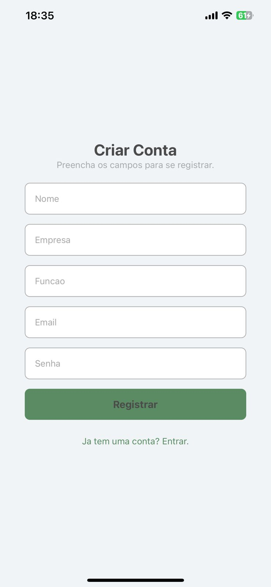
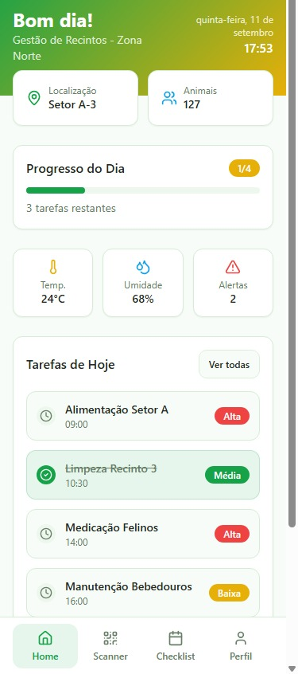
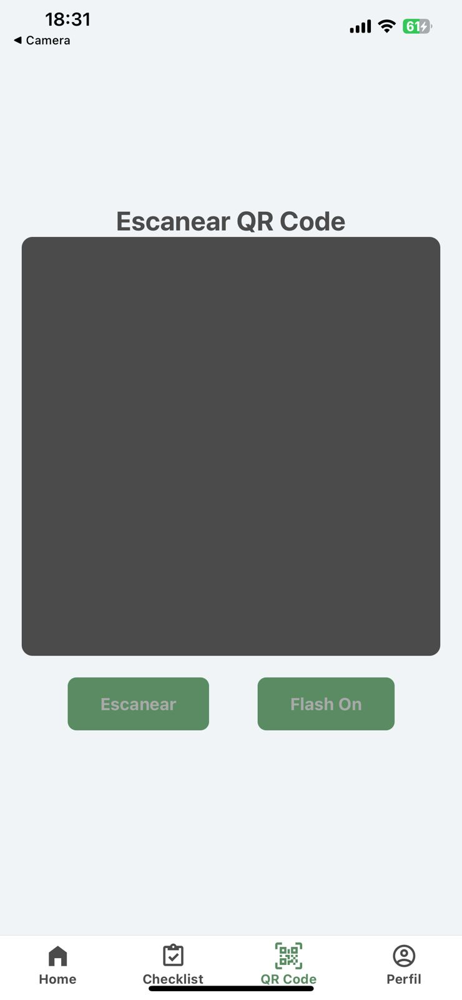
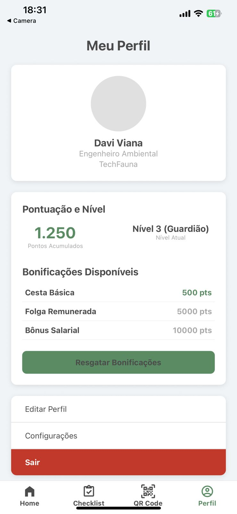
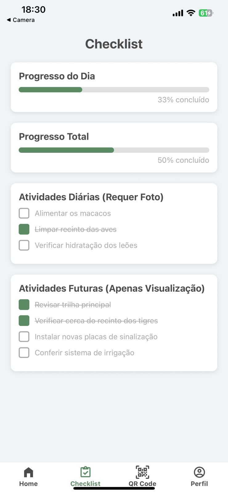

# TechFauna Mobile 🐾


## 📖 Sobre o Projeto

O **TechFauna Mobile** é um aplicativo projetado para facilitar a gestão e a interação de visitantes em um parque, zoológico ou reserva ambiental. A plataforma oferecerá uma experiência interativa e informativa, permitindo que os usuários acessem dados sobre animais, localizem recintos e acompanhem informações relevantes em tempo real.

Este projeto está em desenvolvimento ativo, com o objetivo de finalizar a versão inicial até o final de novembro de 2025.

---

## Funcionalidades e Telas do Aplicativo

Nesta seção, apresentamos as telas do nosso aplicativo, mostrando as funcionalidades que já estão em desenvolvimento.

### **Tela de Login**
Descrição: Permite a validação de credenciais de funcionário para acesso imediato.


### **Tela de Cadastro**
Descrição: Fluxo de cadastro que exige a inserção de Nome, Função e Empresa, direcionando o usuário de volta para a tela de Login após a conclusão.


### **Tela Inicial (Home)**
Descrição: O dashboard central exibe informações essenciais para o dia de trabalho, incluindo data e hora, previsão de localização e clima, e uma barra de progresso visual das tarefas diárias concluídas.


### **Leitor de QR Code**
Descrição: Tela do leitor de QR Code.


### **Tela de Perfil**
Descrição: Exibição dos dados pessoais e integração do sistema de gamificação. Esta tela mostra a Pontuação Acumulada, o Nível do Usuário, e uma lista de bonificações (Cesta Básica, Folga, Bônus Salarial) com destaque visual para os prêmios que o funcionário já pode resgatar.


### **Checklist**
Descrição: Tela para gestão de tarefas diárias e futuras. Possui dois blocos de funcionalidade crítica:

Tarefas Diárias: Requerem comprovação por foto para serem concluídas. O atingimento de 100% aciona a bonificação por pontos.

Tarefas Futuras: São apenas para visualização, com bloqueio de conclusão, exigindo permissão da gerência para adiantamento.


---

## 💻 Tech Stack (Pilha de Tecnologias)

-   **Frontend:** React Native
-   **Backend & Banco de Dados:** Firebase (Firestore, Authentication, Storage)
-   **Navegação:** React Navigation
-   **Mapas:** Google Maps API / OpenStreetMap
-   **Leitor de QR Code:** Expo Barcode Scanner / React Native Camera

---

## 🚀 Roadmap de Desenvolvimento (Agosto - Novembro 2025)

O desenvolvimento será dividido em 3 sprints principais para garantir a entrega contínua e organizada das funcionalidades.

### Sprint 1: Estrutura e Interface (Final de Agosto - Setembro)
*Foco em construir a base visual do aplicativo e implementar as funcionalidades estáticas.*

-   [x] **UI Fix:** Ajustar a posição do "nome" dentro do ícone da foto no Perfil de usuário.
-   [x] **Conteúdo Home:** Adicionar as informações iniciais, textos e imagens na tela `Home`.
-   [x] **Estrutura Dashboard:** Criar a estrutura visual do dashboard de animais na tela `home-user` (sem dados dinâmicos).
-   [x] **Setup de Navegação:** Configurar as rotas principais do aplicativo (Home, Perfil, Mapa, etc.).

### Sprint 2: Funcionalidades Interativas (Outubro)
*Foco em dar vida ao aplicativo com a integração de APIs e funcionalidades de hardware.*

-   [ ] **Implementar Leitor de QR Code:** Adicionar a função de scanner para ler códigos nos recintos.
-   [ ] **API de Animais:** Conectar o leitor de QR Code a uma API para buscar e exibir as informações do animal correspondente.
-   [ ] **Integração do Mapa:** Adicionar a API de mapa no painel `home-user` para exibir a localização do usuário e dos pontos de interesse.
-   [ ] **Refinamento da UI:** Melhorar a experiência do usuário com base nas funcionalidades implementadas.

### Sprint 3: Dados e Finalização (Novembro)
*Foco em conectar o aplicativo ao banco de dados, refinar a lógica de negócios e preparar para a entrega.*

-   [ ] **Dashboard Dinâmico:** Conectar o dashboard da `home-user` ao Firebase para exibir a quantidade de animais em tempo real.
-   [ ] **Testes e Depuração:** Realizar testes completos em todas as funcionalidades para identificar e corrigir bugs.
-   [ ] **Otimização de Performance:** Analisar e melhorar o desempenho geral do aplicativo.
-   [ ] **Build de Lançamento:** Gerar os arquivos de instalação (`.apk` / `.ipa`) e finalizar a documentação.

---


**2. Clone o repositório:**
```bash
git clone [https://github.com/seu-usuario/techfauna-mobile.git](https://github.com/seu-usuario/techfauna-mobile.git)
cd techfauna-mobile
